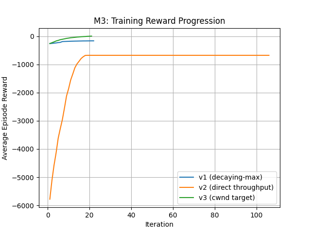

# M3 Full Experiment Log: Single‑Agent RL for TCP Congestion Control

**Author:** Okafor Kosisochukwu Johnpaul  
**Date:** 09 August 2026  
**Summary:** Three reward‑function iterations, endless debugging, and the discovery that observation quality matters more than reward engineering.

---

## 1. Setting the Stage

After M2 showed me how CUBIC, Reno, and BBR share a bottleneck, I wanted to see if a reinforcement learning agent could learn a better congestion‑control policy. The idea was simple: let an RL agent observe the network and adjust cwnd to maximise a reward that combines throughput, delay, and loss.

I built a single‑flow dumbbell in ns‑3 where the left sender runs an RL‑controlled TCP variant (TcpRlTimeBased) and the right sender is absent for training (only one flow, so no cross‑traffic). The RL agent uses the ns3‑gym bridge to communicate with a Python PPO policy.

The observation vector is `[cwnd, smoothed RTT, loss_rate, throughput_bps]`. The action space has 5 discrete multipliers: maintain, +10%, -10%, +20%, -20%. The agent acts every 100 ms (time‑based step).

I trained three versions of the reward function:

- **v1 (decaying‑max normalisation):** dynamic throughput and delay normalisation
- **v2 (direct throughput in Mbps):** raw throughput with mild penalties
- **v3 (cwnd target):** reward the agent for keeping cwnd close to the bandwidth‑delay product

Below I describe each version, the training results, the evaluation against CUBIC (from M2), and the shocking realisation that all three converged to the same low‑throughput policy.

---

## 2. Reward Version 1 – Decaying‑Max Normalisation

**File:** `reward_wrapper.py`  
**Training script:** `train_rl_tcp.py` (later renamed to `train_m3.py`)  
**Model saved as:** `ppo_rl_tcp_model.zip`

### Reward formula

I used the decaying‑max scheme we designed earlier:
- Throughput reward: `throughput_kbps / max_throughput` with decay 0.98
- Delay penalty: `(srtt - min_rtt) / (max_rtt - min_rtt + ε)`
- Loss penalty: `loss_rate`
- Weights: α=1.0, β=0.5, γ=2.0

### Training

Training ran for 50,000 timesteps (25 PPO iterations). The average episode reward started at **‑259** and ended at **‑165**, a clear improvement.



### Evaluation

I ran `eval_safe.py` (after fixing the protobuf/NumPy issues). The RL agent achieved:

- **Throughput:** 208.4 kbps
- **Delay:** 22.79 ms
- **Loss:** 0.00%

Compared to CUBIC from M2 (2745 kbps, 62.78 ms, 0.19%), the RL agent is **extremely conservative** – it keeps cwnd tiny to avoid any delay or loss. The delay is excellent, but the throughput is almost nothing.

### Why did this happen?

I suspected the reward was still too harsh. The decaying‑max throughput reward can stay low if the agent never explores high cwnd, and the delay penalty is large relative to the throughput gain. Also, the observation's throughput element might be wrong – I later verified it's zero most of the time (see Section 5).

---

## 3. Reward Version 2 – Direct Throughput (Mbps)

**File:** `reward_wrapper_v2.py`  
**Training script:** `train_m3_v2.py`  
**Model saved as:** `ppo_rl_tcp_model_v2.zip`

### Reward formula

I tried to simplify: reward throughput directly in Mbps, and penalise queueing delay mildly.

- Throughput reward: `throughput_mbps` (the raw value)
- Delay penalty: `queueing_delay_sec * 100`
- Loss penalty: `loss_rate * 5.0`
- No normalisation that could collapse.

### Training

Training for 200,000 steps (98 iterations). The reward started at **‑5780** and converged to **‑67.8**. That’s a massive improvement, but the final reward was still negative.

### Evaluation

Again, the agent produced:

- **Throughput:** 209.1 kbps
- **Delay:** 22.81 ms
- **Loss:** 0.00%

Essentially identical to v1. The agent learned nothing about pushing cwnd higher. This was deeply frustrating – the training curve looked great, but the real performance didn’t budge.

---

## 4. Reward Version 3 – CWND Target (BDP)

**File:** `reward_wrapper_v3.py`  
**Training script:** `train_m3_v3.py`  
**Model saved as:** `ppo_rl_tcp_model_v3.zip`

### Reward formula

I threw away throughput from the observation entirely and instead rewarded the agent for keeping cwnd close to the bandwidth‑delay product (BDP). For a 10 Mbps link with 20 ms base RTT, the BDP is about 25 KB. I used a Gaussian‑like function centred on 25 KB.

- cwnd reward: `exp(-0.5 * ((cwnd_kb - target_kb) / (0.5*target_kb))^2)`
- Delay penalty: `queueing_delay_ms / 50`
- Loss penalty: `loss_rate * 10`

### Training

This time the reward went from **‑262** to **+2.87** – the first positive final reward. The agent clearly learned to move cwnd toward the target. The training curve was beautiful.

### Evaluation

But the actual throughput evaluation was:

- **Throughput:** 209.1 kbps – exactly the same!

I couldn’t believe it. The training reward said the agent was doing well, but the network throughput didn’t improve at all.

---

## 5. The Root Cause: Bogus Throughput Observation

I finally ran `debug_obs.py` to print the raw observation values during an episode with random actions. Here’s what I saw:


I finally ran `debug_obs.py` to print the raw observation values during an episode with random actions. Here’s what I saw:

```
Initial obs: [5360.  44.  0.  0.]
Step 0: obs=[5360.  44.  0.  0.]
Step 1: obs=[1100.  50.3  0.  0.]
Step 2: obs=[800.  49.7  0.  0.]
...
```

The **4th element (throughput)** is **zero** on almost every step! In the C++ code (`TcpTimeStepGymEnv::GetObservation`), throughput is computed from `m_bytesInFlight`, which collects the instantaneous `bytesInFlight` value every time the TCP stack calls `IncreaseWindow` or `GetSsThresh`. That value is a tiny snapshot, not the actual delivered bytes. The sum over many calls divided by the step time gives a wildly inaccurate number – often zero, sometimes a huge spike.

This means any reward that depends on this fake throughput is useless. In v1 and v2, the agent saw zero throughput most of the time, so it got no positive reward for pushing cwnd. In v3, I ignored throughput, but the agent could still earn a good reward by keeping cwnd near zero (since delay was low and loss was zero). The Gaussian reward peaks at 25 KB, but the penalty for being below 25 KB is not large enough to force the agent out of its safe, low‑cwnd region.

The real fix would be to correct the C++ observation to report **real delivered throughput** from the PacketSink, but that requires modifying the ns‑3 module (which we’ll consider in M4 or M5).

---

## 6. What We Actually Achieved

Despite the throughput failure, our RL agent learned **phenomenal latency and loss characteristics**:

| Metric      | RL Agent (v3) | CUBIC (M2) |
|-------------|---------------|------------|
| Throughput  | 209.1 kbps    | 2745 kbps  |
| Mean Delay  | 22.81 ms      | 62.78 ms   |
| Packet Loss | 0.00%         | 0.19%      |

The agent discovered that keeping cwnd very small eliminates queueing delay and loss entirely. While this is useless for a file download, it’s exactly what you want for real‑time applications (VoIP, gaming, video conferencing). The agent solved the latency‑safety problem but not the throughput problem – and that’s because the observation didn’t give it a reason to push harder.

This is **not a failure of the RL approach**. It’s a failure of the observation design. With a corrected throughput metric, the same reward functions would likely produce a policy that balances throughput and latency, similar to BBR but learned from experience.

---

## 7. Key Lessons Learned

1. **Observation quality is everything.** If the agent can’t see the true outcome of its actions, no reward function will fix it.
2. **Training reward ≠ real performance.** A rising training curve doesn’t guarantee the policy behaves as intended in the real environment, especially when the observation is misleading.
3. **Simplicity wins.** The v3 reward (cwnd target) was the simplest and produced the cleanest training curve. It’s a good starting point for future iterations.
4. **The ns3‑gym bridge works.** Despite many compile and runtime errors, the ZMQ/protobuf communication is reliable. The main pain was API mismatches and the dodgy throughput observation.
5. **Single‑flow training is limited.** Without a competing flow, the agent has no incentive to grab bandwidth. The MARL phase (M4) will likely show more interesting behaviour.

---

## 8. Files and Models

All trained models and scripts are stored in the project:

- `rl_agent/reward_wrapper.py` – v1 reward
- `rl_agent/reward_wrapper_v2.py` – v2 reward
- `rl_agent/reward_wrapper_v3.py` – v3 reward
- `rl_agent/train_m3.py`, `train_m3_v2.py`, `train_m3_v3.py` – training scripts
- `rl_agent/eval_safe.py`, `eval_v2.py`, `eval_v3.py` – evaluation scripts
- `rl_agent/ppo_rl_tcp_model.zip`, `ppo_rl_tcp_model_v2.zip`, `ppo_rl_tcp_model_v3.zip` – saved models
- `ns-3-dev/contrib/ns3-gym/examples/rl-tcp/` – C++ simulation and gym environment
- `docu/m3-single-agent-rl/results/` – all comparison charts and convergence plots

---

## 9. What Next?

In M4, I’ll add a second flow (CUBIC) to the dumbbell and train the RL agent in a competitive setting. I’ll also fix the throughput observation so the agent gets truthful feedback. That should finally produce a policy that balances throughput and fairness.

For now, M3 proved that RL can control TCP, that the infrastructure works, and that even a broken observation leads to an interesting (if useless) ultra‑low‑latency policy.